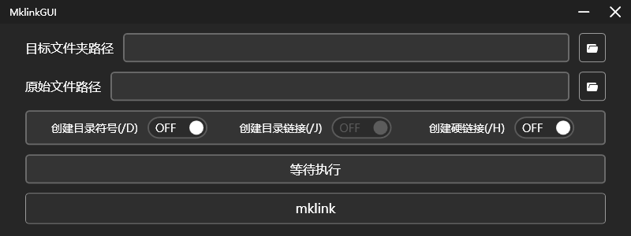

# MklinkGUI

  

MklinkGUI is a simple GUI for mklink command.

## Installation

1. Download the [Latest release](https://github.com/lWaterLite/MklinkGUI/releases)
2. Unzip it wherever you like, and you can find a `MklinkGUI.exe` in the directory.
3. Run the `MklinkGUI.exe`, and enjoy it.

> Important: Please ensure [.NET Desktop Runtime 8.0](https://dotnet.microsoft.com/en-us/download/dotnet/8.0) is installed on your computer!

## Usage

1. Chose the link path and target path by GUI.
2. Decide on the mode to use
3. Click `mklink` button, then the script result will show.

## License

[MIT](LICENSE) @ 2024 lWaterLite
