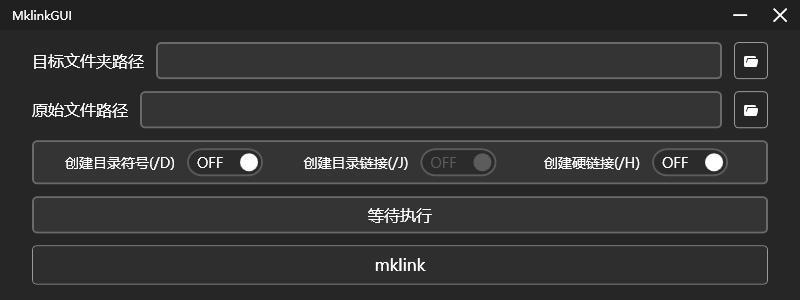

# MklinkGUI

  

MklinkGUI 是一个简单的给mklink命令使用的桌面程序。

## 安装

1. 下载[Latest release](https://github.com/lWaterLite/MklinkGUI/releases)。
2. 在任何你喜欢的地方解压压缩文件，你可以在目录中找到 `MklinkGUI.exe` 文件。
3. 运行 `MklinkGUI.exe`。

> 重要: 请确保您的电脑上安装了[.NET Desktop Runtime 8.0](https://dotnet.microsoft.com/en-us/download/dotnet/8.0)。

## 使用

1. 使用按钮选择目标路径和原始路径。
2. 选择你需要的模式。
3. 按下`mklink`按钮, 脚本会自动运行，运行结果会显示。

## 使用许可

[MIT](LICENSE) @ 2024 lWaterLite
